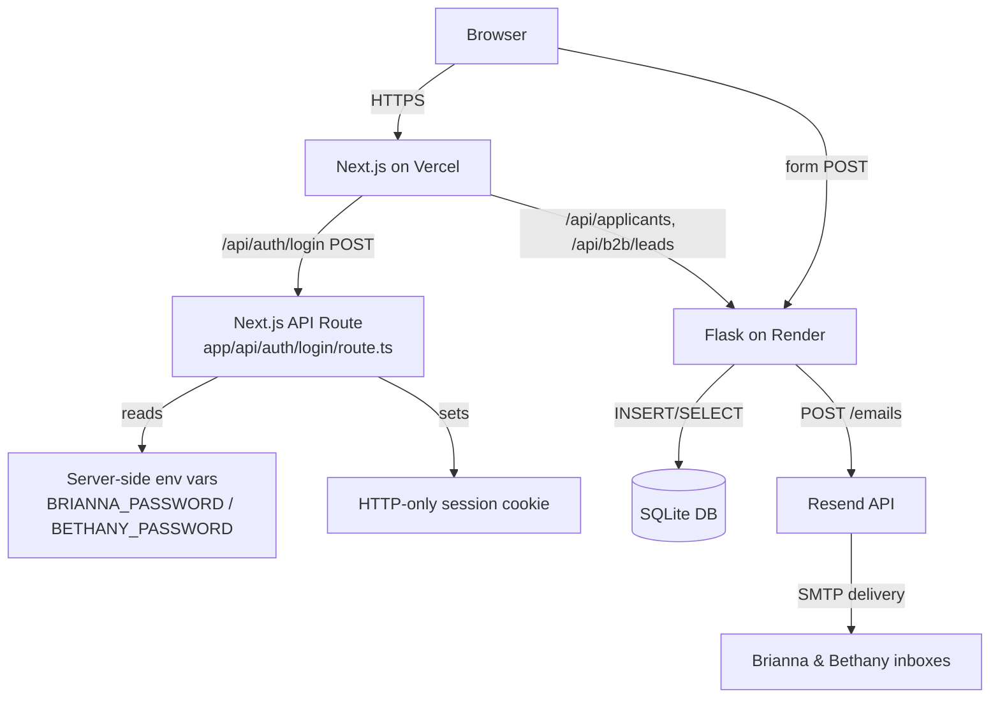

# Design Document: Phase 1 Foundation

## Overview

Phase 1 Foundation delivers six targeted improvements to the Cronan AI platform. The platform is a Next.js 16.2 (App Router) frontend on Vercel paired with a Flask/Python backend on Render backed by SQLite. All changes are additive or surgical — no architectural rewrites are required.

The six work streams are:

1. **Countdown update** — change target from April 1 2026 to August 5 2026 @ 3:00 PM ET
2. **Privacy page** — new `/privacy` route
3. **Investors page** — new `/investors` route, Article VII content migrated from `/guidelines`
4. **Email notifications** — Resend integration in the Flask backend
5. **Secure admin auth** — move credential check to a Next.js API route using HTTP-only cookies
6. **Expanded forms** — additional fields on both the trainer and B2B forms, with matching backend schema changes

---

## Architecture



Key architectural decisions:

- **No NextAuth / third-party auth library** — the session is a simple signed HTTP-only cookie set by the Next.js API route. This keeps the dependency footprint minimal and avoids over-engineering for a two-user admin panel.
- **Resend SDK (Python)** — `resend` pip package is added to `backend/requirements.txt`. Email dispatch is fire-and-forget inside the Flask route; failures are logged but do not block the 200 response.
- **SQLite schema migration via `ALTER TABLE`** — existing tables are extended with `ALTER TABLE … ADD COLUMN IF NOT EXISTS` statements run at startup so the live database is not wiped.
- **Resume upload deferred** — file storage (S3 / Cloudflare R2) is not in scope for Phase 1. The frontend field is present but the form note explains it is coming soon; the backend does not yet store a file reference.

---

## Components and Interfaces

### 1. Countdown Timer (`frontend/app/page.tsx`)

**Change**: Update the `targetDate` constant.

```ts
// Before
const targetDate = new Date('2026-04-01T12:00:00').getTime();

// After
const targetDate = new Date('2026-08-05T15:00:00-04:00').getTime();
```

No other changes to this component.

---

### 2. Privacy Page (`frontend/app/privacy/page.tsx`)

New Server Component (no `"use client"` needed — static content).

Sections:
- Data We Collect
- How We Use Your Data
- Data Storage & Security
- Third-Party Services (Resend, Vercel, Render)
- Your Rights
- Contact Information
- Link back to `/`

Visual style: matches existing dark theme (slate-900 card, cyan accent headings).

---

### 3. Investors Page (`frontend/app/investors/page.tsx`)

New Server Component. Content sourced from Article VII of `/guidelines`:
- 7.1 Vision for Scalability
- 7.2 Open for Seed Investment & Angel Partnerships
- 7.3 Capital Allocation Strategy
- 7.4 Investor Inquiries + contact emails

Article VII is **removed** from `/guidelines/page.tsx` and replaced with a short "For investor information, visit our [Investors page](/investors)" callout.

Navigation changes:
- `Header.tsx` — add `{ href: '/investors', label: 'Investors', color: 'hover:text-amber-500' }` to the links array
- `layout.tsx` footer — add `<a href="/investors">Investors</a>` link alongside the existing footer links

---

### 4. Email Notifications (`backend/app.py`)

**New dependency**: `resend` added to `backend/requirements.txt`.

**Environment variable**: `RESEND_API_KEY` in `backend/.env` (already present per spec).

**Helper function** added to `app.py`:

```python
def send_notification(subject: str, html_body: str) -> None:
    """Fire-and-forget email to both founders. Logs on failure."""
    try:
        import resend
        resend.api_key = os.environ.get("RESEND_API_KEY", "")
        resend.Emails.send({
            "from": "notifications@cronantech.com",
            "to": ["Brianna@CronanTech.com", "Bethany@CronanTech.com"],
            "subject": subject,
            "html": html_body,
        })
    except Exception as e:
        print(f"[Resend] Failed to send notification: {e}")
```

Called after successful DB insert in `/api/apply` and `/api/b2b/apply`. The `try/except` ensures a Resend failure never causes a 500 to the client.

---

### 5. Secure Admin Authentication

#### 5a. Next.js API Route (`frontend/app/api/auth/login/route.ts`)

```
POST /api/auth/login
Body: { email: string, password: string }
```

Server-side logic:
1. Read `BRIANNA_PASSWORD` and `BETHANY_PASSWORD` from `process.env` (never `NEXT_PUBLIC_`).
2. Match submitted `email` + `password` against the two accounts.
3. On match: create a signed session payload `{ email, name, accentColor }`, set as an HTTP-only cookie named `cronan_session` (SameSite=Lax, Secure in production, 8-hour max-age), return `200 { ok: true, name, accentColor }`.
4. On mismatch: return `401 { error: "Invalid credentials" }`.

Cookie signing uses `jose` (already available in Next.js environments) or a simple HMAC with `SESSION_SECRET` env var.

```
DELETE /api/auth/login  (sign-out)
```
Clears the `cronan_session` cookie by setting `Max-Age=0`.

#### 5b. Admin Dashboard (`frontend/app/admin/page.tsx`)

- Remove the `STAFF` constant and all `NEXT_PUBLIC_` password references.
- On mount, call `GET /api/auth/me` (or decode the cookie client-side via a `/api/auth/session` route) to determine if a session exists.
- Login form POSTs to `/api/auth/login`; on success, stores returned `{ name, accentColor }` in React state.
- Sign-out calls `DELETE /api/auth/login`.
- All admin data fetches (`/api/applicants`, `/api/b2b/leads`, etc.) remain unchanged — they hit the Flask backend directly with `NEXT_PUBLIC_API_URL`.

> Note: The Flask admin data endpoints (`/api/applicants`, `/api/b2b/leads`) are currently unauthenticated. Securing those with a shared secret header is out of scope for Phase 1 but noted as a follow-up.

---

### 6. Expanded Trainer Form (`frontend/app/agency/page.tsx`)

New fields added to the form state and JSX:

| Field | Type | Required | Notes |
|---|---|---|---|
| `phone` | `<input type="tel">` | Yes | Standard tel input |
| `linkedinUrl` | `<input type="url">` | No | Optional |
| `availabilityHours` | `<input type="number" min="1" max="168">` | Yes | Hours/week |
| `workType` | Read-only display | — | "Remote Only" (informational) |
| `agreedToTerms` | `<input type="checkbox">` | Yes | Must be checked to submit |

Resume upload field is rendered as a disabled/coming-soon input with a note.

Form `POST` body gains: `phone`, `linkedinUrl`, `availabilityHours`.

---

### 7. Expanded B2B Form (`frontend/app/b2b/page.tsx`)

New fields:

| Field | Type | Required | Options |
|---|---|---|---|
| `phone` | `<input type="tel">` | Yes | — |
| `companySize` | `<select>` | Yes | 1–10, 11–50, 51–200, 201–1000, 1000+ |
| `industry` | `<select>` | Yes | Technology, Healthcare, Finance, E-commerce, Education, Other |
| `budgetRange` | `<select>` | Yes | Under $5K, $5K–$25K, $25K–$100K, $100K+ |
| `timeline` | `<select>` | Yes | Immediately, Within 1 month, 1–3 months, 3–6 months, Exploring options |
| `referralSource` | `<select>` | Yes | LinkedIn, Google Search, Referral, Social Media, Other |
| `message` | `<textarea maxLength={1000}>` | No | Optional |

---

## Data Models

### SQLite Schema Changes

Both tables are extended at startup using `ALTER TABLE … ADD COLUMN` wrapped in a try/except to be idempotent (SQLite does not support `IF NOT EXISTS` on `ADD COLUMN`).

#### `applicants` table — new columns

```sql
ALTER TABLE applicants ADD COLUMN phone TEXT;
ALTER TABLE applicants ADD COLUMN linkedin_url TEXT;
ALTER TABLE applicants ADD COLUMN availability_hours INTEGER;
```

#### `business_leads` table — new columns

```sql
ALTER TABLE business_leads ADD COLUMN phone TEXT;
ALTER TABLE business_leads ADD COLUMN company_size TEXT;
ALTER TABLE business_leads ADD COLUMN industry TEXT;
ALTER TABLE business_leads ADD COLUMN budget_range TEXT;
ALTER TABLE business_leads ADD COLUMN timeline TEXT;
ALTER TABLE business_leads ADD COLUMN referral_source TEXT;
ALTER TABLE business_leads ADD COLUMN message TEXT;
```

### Migration strategy

```python
def migrate_db():
    """Add new columns to existing tables without dropping data."""
    new_applicant_cols = [
        ("phone", "TEXT"),
        ("linkedin_url", "TEXT"),
        ("availability_hours", "INTEGER"),
    ]
    new_lead_cols = [
        ("phone", "TEXT"),
        ("company_size", "TEXT"),
        ("industry", "TEXT"),
        ("budget_range", "TEXT"),
        ("timeline", "TEXT"),
        ("referral_source", "TEXT"),
        ("message", "TEXT"),
    ]
    with sqlite3.connect(DB_NAME) as conn:
        cursor = conn.cursor()
        for col, col_type in new_applicant_cols:
            try:
                cursor.execute(f"ALTER TABLE applicants ADD COLUMN {col} {col_type}")
            except sqlite3.OperationalError:
                pass  # column already exists
        for col, col_type in new_lead_cols:
            try:
                cursor.execute(f"ALTER TABLE business_leads ADD COLUMN {col} {col_type}")
            except sqlite3.OperationalError:
                pass
        conn.commit()
```

`migrate_db()` is called after `init_db()` at startup.

### Session Token

The admin session is a JWT signed with `HS256` using `SESSION_SECRET` (server-side env var). Payload:

```json
{
  "email": "brianna@cronantech.com",
  "name": "Brianna Cronan",
  "accentColor": "amber",
  "exp": <unix timestamp + 8 hours>
}
```

Stored as an HTTP-only cookie named `cronan_session`. The `jose` library (bundled with Next.js) is used for signing/verification.

---

## Error Handling

| Scenario | Behavior |
|---|---|
| Resend API key missing or invalid | `send_notification` catches exception, logs to stdout, returns normally — form submission still succeeds |
| DB column already exists on restart | `migrate_db` catches `sqlite3.OperationalError`, continues silently |
| Invalid admin credentials | Auth API returns 401; client shows inline error message |
| Expired/missing session cookie | `/api/auth/session` returns 401; admin page shows login form |
| Form submitted with missing required fields | HTML5 `required` attribute prevents submission client-side; backend also validates and returns 400 |
| B2B message exceeds 1000 chars | `maxLength={1000}` on textarea; backend truncates or rejects with 400 |
| Countdown reaches zero | `distance < 0` branch sets all units to 0 and clears the interval |

---

## Correctness Properties

*A property is a characteristic or behavior that should hold true across all valid executions of a system — essentially, a formal statement about what the system should do. Properties serve as the bridge between human-readable specifications and machine-verifiable correctness guarantees.*

### Property 1: Countdown decomposition round-trip

*For any* positive duration in milliseconds, decomposing it into days/hours/minutes/seconds and then reconstructing the total milliseconds from those units should yield the original value (modulo the 1-second floor).

**Validates: Requirements 1.3**

---

### Property 2: Valid form submission triggers notification to both founders

*For any* valid trainer or B2B form payload, after a successful database insert the notification service should be invoked exactly once with both `Brianna@CronanTech.com` and `Bethany@CronanTech.com` in the recipient list.

**Validates: Requirements 4.1, 4.2**

---

### Property 3: Notification email contains submitter details and correct sender

*For any* valid form submission, the notification email body should contain the submitter's name, email address, and primary specialty or project type, and the "from" field should equal the configured sender address.

**Validates: Requirements 4.3, 4.6**

---

### Property 4: Resend failure does not block database persistence

*For any* valid form submission where the Resend API raises an exception, the applicant or lead record should still be present in the database and the HTTP response should be 200.

**Validates: Requirements 4.4**

---

### Property 5: Valid credentials produce an HTTP-only session cookie

*For any* valid staff credential pair (either account), the auth API should return HTTP 200 and set a cookie named `cronan_session` with the `HttpOnly` flag.

**Validates: Requirements 5.3**

---

### Property 6: Invalid credentials always return 401

*For any* credential pair that does not match a known staff account (wrong email, wrong password, or both), the auth API should return HTTP 401 and should not set a session cookie.

**Validates: Requirements 5.4**

---

### Property 7: Missing required fields return 400

*For any* form submission (trainer or B2B) where one or more required fields are absent or empty, the backend should return HTTP 400 and should not insert a record into the database.

**Validates: Requirements 6.1, 6.3, 6.6, 7.1, 7.2, 7.3, 7.4, 7.5, 7.6**

---

### Property 8: New form fields round-trip through the database

*For any* valid trainer or B2B submission that includes the new extended fields, querying the database for that record should return field values equal to those that were submitted.

**Validates: Requirements 6.7, 7.8**

---

### Property 9: Availability hours boundary enforcement

*For any* trainer submission where `availability_hours` is less than 1 or greater than 168, the backend should return HTTP 400 and should not insert a record.

**Validates: Requirements 6.3**

---

### Property 10: B2B message length enforcement

*For any* B2B submission where the optional message field exceeds 1000 characters, the backend should return HTTP 400 and should not insert a record.

**Validates: Requirements 7.7**


---

## Testing Strategy

### Dual Approach

Both unit tests and property-based tests are required. They are complementary:
- Unit tests catch concrete bugs at specific inputs and integration points.
- Property tests verify universal correctness across randomized inputs.

### Unit Tests

**Frontend (Jest + React Testing Library)**

- `page.tsx` countdown: assert `new Date('2026-08-05T15:00:00-04:00').getTime()` equals `1754420400000`.
- `page.tsx` countdown zero: pass a negative `distance` to the calculation function, assert all units are 0.
- `/api/auth/login` route: mock `process.env`, assert 200 + cookie on correct credentials; assert 401 on wrong password; assert 401 on unknown email.
- Admin page without cookie: render `AdminDashboard` with no session, assert login form is visible and data tables are not rendered.
- Sign-out: after sign-out call, assert `cronan_session` cookie is cleared.
- Privacy page: render, assert all six required section headings are present and a link to `/` exists.
- Investors page: render, assert Article VII headings are present, both `mailto:` links exist, and a link to `/` exists.
- Header: render, assert `href="/investors"` link is present.

**Backend (pytest)**

- `migrate_db`: run twice on a fresh in-memory DB, assert no exception and column count is stable.
- `send_notification` with valid key: mock `resend.Emails.send`, assert called with correct `to` list and `from` address.
- `send_notification` with exception: mock raises `Exception`, assert no exception propagates from the helper.
- `/api/apply` with all required fields: assert 200 and DB row exists.
- `/api/apply` missing `phone`: assert 400 and no DB row.
- `/api/b2b/apply` with all required fields: assert 200 and DB row exists.
- `/api/b2b/apply` missing `company_size`: assert 400 and no DB row.

### Property-Based Tests

**Backend — Hypothesis**

Each test runs `@settings(max_examples=100)`.

```python
# Feature: phase-1-foundation, Property 2: valid submission triggers notification to both founders
@given(valid_trainer_payload())
def test_trainer_notification_recipients(payload):
    with mock.patch("app.resend.Emails.send") as mock_send:
        client.post("/api/apply", json=payload)
        recipients = mock_send.call_args[0][0]["to"]
        assert "Brianna@CronanTech.com" in recipients
        assert "Bethany@CronanTech.com" in recipients

# Feature: phase-1-foundation, Property 3: notification contains submitter details
@given(valid_trainer_payload())
def test_notification_body_contains_submitter_info(payload):
    with mock.patch("app.resend.Emails.send") as mock_send:
        client.post("/api/apply", json=payload)
        html = mock_send.call_args[0][0]["html"]
        assert payload["name"] in html
        assert payload["email"] in html

# Feature: phase-1-foundation, Property 4: Resend failure does not block DB save
@given(valid_trainer_payload())
def test_resend_failure_does_not_block_save(payload):
    with mock.patch("app.resend.Emails.send", side_effect=Exception("network error")):
        resp = client.post("/api/apply", json=payload)
        assert resp.status_code == 200
        # verify DB row exists
        rows = get_applicants_from_db()
        assert any(r["email"] == payload["email"] for r in rows)

# Feature: phase-1-foundation, Property 7: missing required fields return 400
@given(trainer_payload_missing_one_required_field())
def test_missing_required_field_returns_400(payload):
    resp = client.post("/api/apply", json=payload)
    assert resp.status_code == 400

# Feature: phase-1-foundation, Property 8: new fields round-trip through DB
@given(valid_trainer_payload_with_extended_fields())
def test_trainer_extended_fields_round_trip(payload):
    client.post("/api/apply", json=payload)
    rows = get_applicants_from_db()
    saved = next(r for r in rows if r["email"] == payload["email"])
    assert saved["phone"] == payload["phone"]
    assert saved["availability_hours"] == payload["availabilityHours"]

# Feature: phase-1-foundation, Property 9: availability hours boundary
@given(st.integers().filter(lambda x: x < 1 or x > 168))
def test_invalid_availability_hours_returns_400(hours):
    payload = {**base_trainer_payload(), "availabilityHours": hours}
    resp = client.post("/api/apply", json=payload)
    assert resp.status_code == 400

# Feature: phase-1-foundation, Property 10: B2B message length enforcement
@given(st.text(min_size=1001))
def test_b2b_message_too_long_returns_400(message):
    payload = {**base_b2b_payload(), "message": message}
    resp = client.post("/api/b2b/apply", json=payload)
    assert resp.status_code == 400
```

**Frontend — fast-check**

```ts
// Feature: phase-1-foundation, Property 1: countdown decomposition round-trip
fc.assert(fc.property(
  fc.integer({ min: 1000, max: 1_000_000_000_000 }),
  (ms) => {
    const days = Math.floor(ms / 86_400_000);
    const hours = Math.floor((ms % 86_400_000) / 3_600_000);
    const minutes = Math.floor((ms % 3_600_000) / 60_000);
    const seconds = Math.floor((ms % 60_000) / 1000);
    const reconstructed = (days * 86_400 + hours * 3_600 + minutes * 60 + seconds) * 1000;
    return Math.abs(reconstructed - ms) < 1000; // within 1 second floor
  }
), { numRuns: 100 });

// Feature: phase-1-foundation, Property 5: valid credentials produce HTTP-only cookie
fc.assert(fc.property(
  fc.constantFrom('brianna@cronantech.com', 'bethany@cronantech.com'),
  async (email) => {
    const password = email.startsWith('brianna') ? process.env.BRIANNA_PASSWORD : process.env.BETHANY_PASSWORD;
    const res = await POST('/api/auth/login', { email, password });
    return res.status === 200 && res.headers['set-cookie']?.some(c => c.includes('HttpOnly'));
  }
), { numRuns: 100 });

// Feature: phase-1-foundation, Property 6: invalid credentials always return 401
fc.assert(fc.property(
  fc.record({ email: fc.emailAddress(), password: fc.string() })
    .filter(({ email }) => !['brianna@cronantech.com','bethany@cronantech.com'].includes(email)),
  async ({ email, password }) => {
    const res = await POST('/api/auth/login', { email, password });
    return res.status === 401;
  }
), { numRuns: 100 });
```

### Test Configuration

- Backend: `pytest` with `pytest-hypothesis`; `RESEND_API_KEY=test` in test environment; use an in-memory SQLite DB (`":memory:"`) for isolation.
- Frontend: `jest` + `@fast-check/jest`; mock `fetch` for API route tests.
- CI: both suites run on every pull request before merge.
