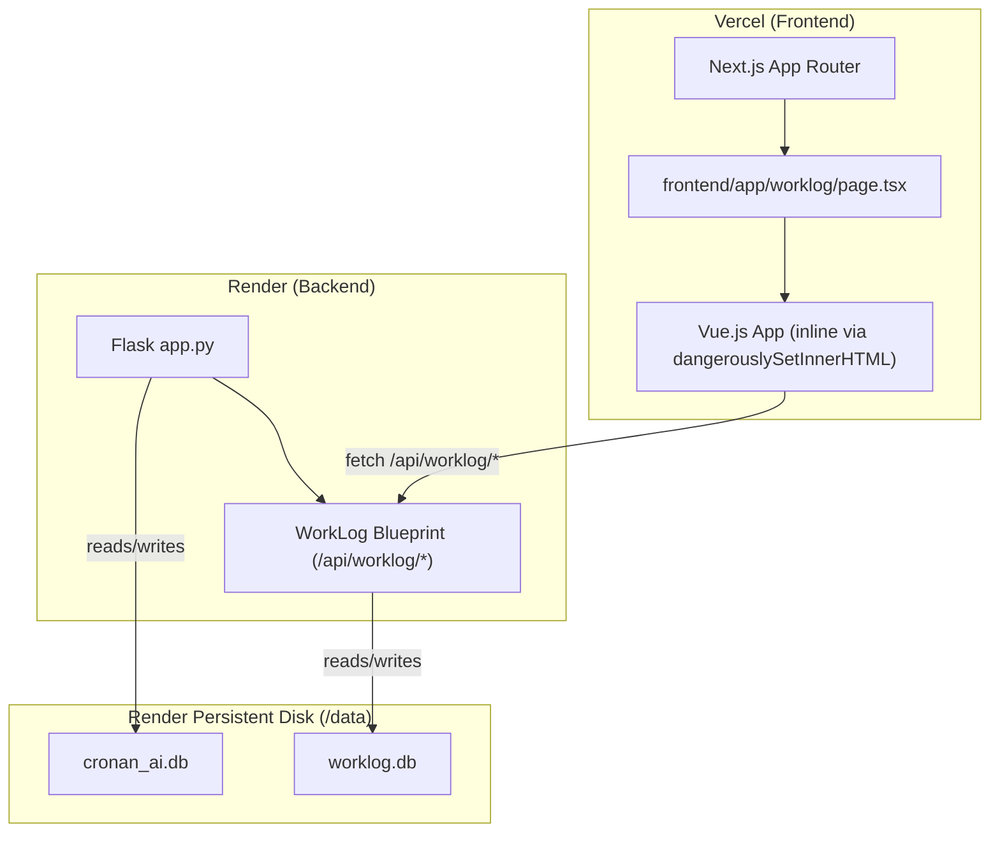

# Design Document: WorkLog Integration

## Overview

WorkLog Pro is integrated into the Cronan AI platform by merging its Flask API routes into the existing `backend/app.py` and serving its Vue.js frontend as a new Next.js page at `cronantech.com/worklog`. The integration uses a separate `worklog.db` SQLite database, moves all credentials to environment variables, and adds multi-employee support with role-based access control. The existing Vue.js single-page application is embedded inline within a Next.js `"use client"` page component using `dangerouslySetInnerHTML` to avoid a Vue build step.

The design preserves all existing WorkLog Pro functionality while adding: employee account management, per-employee data scoping, an analytics dashboard with Chart.js, and a non-destructive migration path from the prior standalone PythonAnywhere deployment.

---

## Architecture



**Key architectural decisions:**

- The Vue.js app is embedded as a raw HTML string inside a Next.js page using `dangerouslySetInnerHTML`. This avoids any Vue build tooling and keeps the integration minimal. The page uses `"use client"` so the script tags execute in the browser.
- The WorkLog Flask routes are organized as a Flask `Blueprint` registered on the main `app` with the `/api/worklog` prefix. This keeps the worklog code isolated from the existing Cronan routes.
- `worklog.db` lives in the same `DB_DIR` directory as `cronan_ai.db` on the Render persistent disk, but is a completely separate file. The two databases never share a connection.
- Flask sessions are shared (same `SECRET_KEY`) but the worklog session data is stored under a namespaced key (`worklog_user`) so it does not collide with any existing Cronan session data.

---

## Components and Interfaces

### Backend: WorkLog Blueprint (`backend/worklog_api.py`)

A new file `backend/worklog_api.py` defines a Flask `Blueprint` named `worklog_bp`. The main `app.py` imports and registers it:

```python
# backend/app.py (addition)
from worklog_api import worklog_bp, init_worklog
init_worklog(app)  # validates env vars, registers blueprint
```

The blueprint exposes these routes:

| Method | Route | Auth Required | Role |
|--------|-------|--------------|------|
| POST | `/api/worklog/login` | No | — |
| POST | `/api/worklog/logout` | Yes | any |
| GET | `/api/worklog/session` | No | — |
| GET | `/api/worklog/history` | Yes | admin, viewer |
| POST | `/api/worklog/save` | Yes | admin |
| POST | `/api/worklog/delete` | Yes | admin |
| GET | `/api/worklog/employees` | Yes | admin |
| POST | `/api/worklog/employees` | Yes | admin |
| PUT | `/api/worklog/employees/<id>` | Yes | admin |
| POST | `/api/worklog/employees/<id>/reset-password` | Yes | admin |

Two decorator helpers enforce auth:

```python
def worklog_login_required(f): ...   # returns 401 if no worklog session
def admin_required(f): ...           # returns 403 if role != 'admin'
```

### Frontend: WorkLog Page (`frontend/app/worklog/page.tsx`)

A single Next.js page component marked `"use client"`. It renders a `<div id="app">` and injects the Vue.js application HTML via `dangerouslySetInnerHTML`. CDN script tags for Vue 3 and Chart.js are injected using `next/script` with `strategy="beforeInteractive"` to ensure they load before the Vue app initializes.

```
frontend/app/worklog/
└── page.tsx          ← "use client", renders Vue app inline
```

The Vue app HTML is stored as a template string in a separate file:

```
frontend/app/worklog/
├── page.tsx
└── worklog-app.html  ← raw Vue template string (imported as a string)
```

This keeps the page component clean while allowing the Vue HTML to be edited independently.

### Vue.js Application

The existing Vue.js SPA is adapted with these changes:
- Template delimiters changed to `[[ ]]`
- `API_BASE` constant set from a `data-api-url` attribute on the mount element (populated by Next.js from `NEXT_PUBLIC_API_URL`)
- All `fetch` calls prefixed with `/api/worklog/`
- Role-based UI sections controlled by a `role` reactive property (`null`, `'admin'`, `'viewer'`)
- Analytics dashboard added as a new tab/view using Chart.js

---

## Data Models

### `worklog.db` Schema

#### `users` table (Users_Table)

```sql
CREATE TABLE IF NOT EXISTS users (
    id          INTEGER PRIMARY KEY AUTOINCREMENT,
    username    TEXT    NOT NULL UNIQUE,
    password_hash TEXT  NOT NULL,
    is_active   INTEGER NOT NULL DEFAULT 1,
    created_at  TEXT    NOT NULL DEFAULT (datetime('now'))
);
```

#### `history` table (History_Table)

```sql
CREATE TABLE IF NOT EXISTS history (
    id          INTEGER PRIMARY KEY AUTOINCREMENT,
    employee_id INTEGER NOT NULL DEFAULT 0,
    week_ending TEXT    NOT NULL,
    ref_number  TEXT    NOT NULL,
    net_pay     REAL    NOT NULL,
    full_data   TEXT    NOT NULL,  -- JSON blob
    created_at  TEXT    NOT NULL DEFAULT (datetime('now')),
    UNIQUE(employee_id, week_ending)
);
```

`employee_id = 0` is the reserved admin ID. Admin records saved via the admin session use `employee_id = 0`.

#### Migration Strategy

On startup, `init_worklog_db()` runs these steps idempotently:

1. `CREATE TABLE IF NOT EXISTS users (...)` — safe no-op if table exists
2. `CREATE TABLE IF NOT EXISTS history (...)` — safe no-op if table exists
3. `ALTER TABLE history ADD COLUMN employee_id INTEGER NOT NULL DEFAULT 0` — wrapped in try/except for `OperationalError` (column already exists)
4. `ALTER TABLE history ADD COLUMN created_at TEXT NOT NULL DEFAULT (datetime('now'))` — same pattern

This means an existing `worklog.db` from the prior standalone deployment is opened as-is, existing rows get `employee_id = 0` (admin), and no data is lost.

### Session Data Model

WorkLog session data is stored in Flask's server-side session under the key `worklog_user`:

```python
session['worklog_user'] = {
    'username': str,
    'employee_id': int,   # 0 for admin
    'role': 'admin' | 'viewer'
}
```

### API Request/Response Shapes

**POST /api/worklog/login**
```json
// Request
{ "username": "string", "password": "string" }
// Response 200
{ "role": "admin" | "viewer", "employee_id": 0 }
// Response 401
{ "error": "Invalid credentials" }
```

**GET /api/worklog/session**
```json
// Response 200
{ "authenticated": true, "role": "admin" | "viewer", "employee_id": 0 }
// Response 401
{ "authenticated": false }
```

**GET /api/worklog/history**
```json
// Query params (admin only): ?employee_id=<int>
// Response 200
[
  {
    "id": 1,
    "employee_id": 0,
    "week_ending": "2025-01-10",
    "ref_number": "REF-001",
    "net_pay": 1200.00,
    "full_data": "{...}",
    "created_at": "2025-01-10T12:00:00"
  }
]
```

**POST /api/worklog/save**
```json
// Request
{
  "week_ending": "2025-01-10",
  "ref_number": "REF-001",
  "net_pay": 1200.00,
  "full_data": "{...}"
}
// Response 200
{ "message": "Saved", "id": 1 }
// Response 400
{ "error": "Missing required field: week_ending" }
```

**POST /api/worklog/delete**
```json
// Request
{ "id": 1 }
// Response 200
{ "message": "Deleted" }
// Response 404
{ "error": "Record not found" }
```

**POST /api/worklog/employees**
```json
// Request
{ "username": "jsmith", "password": "secret123" }
// Response 201
{ "id": 2, "username": "jsmith" }
// Response 409
{ "error": "Username already exists" }
```

**GET /api/worklog/employees**
```json
// Response 200
[
  { "id": 1, "username": "jsmith", "is_active": true, "created_at": "..." }
]
```

**PUT /api/worklog/employees/<id>**
```json
// Request
{ "is_active": false }
// Response 200
{ "message": "Updated" }
```

**POST /api/worklog/employees/<id>/reset-password**
```json
// Request
{ "password": "newpassword" }
// Response 200
{ "message": "Password updated" }
```

---

## Error Handling

| Scenario | HTTP Status | Response |
|----------|------------|----------|
| Missing required login fields | 400 | `{"error": "username and password required"}` |
| Invalid credentials | 401 | `{"error": "Invalid credentials"}` |
| Inactive employee login | 401 | `{"error": "Account is inactive"}` |
| No session on protected route | 401 | `{"error": "Authentication required"}` |
| Viewer accessing admin route | 403 | `{"error": "Admin access required"}` |
| Viewer deleting another's record | 403 | `{"error": "Access denied"}` |
| Record not found on delete | 404 | `{"error": "Record not found"}` |
| Duplicate username on create | 409 | `{"error": "Username already exists"}` |
| Missing required save fields | 400 | `{"error": "Missing required field: <field>"}` |
| WorkLog_DB unavailable | 500 | `{"error": "Database error"}` |
| Missing admin env vars at startup | — | Log error, skip blueprint registration |

**Database error isolation:** All WorkLog blueprint route handlers wrap database operations in try/except. A `sqlite3.Error` returns HTTP 500 with a generic error message and logs the full exception. The main Cronan routes are unaffected because they use a separate database connection and file.

**Startup validation:** `init_worklog(app)` checks for `WORKLOG_ADMIN_USERNAME` and `WORKLOG_ADMIN_PASSWORD` before registering the blueprint. If either is missing, it logs:
```
[WorkLog] ERROR: Missing environment variable: WORKLOG_ADMIN_USERNAME
[WorkLog] WorkLog routes NOT registered.
```
and returns without registering the blueprint, so all `/api/worklog/*` routes return 404.

---


## Correctness Properties

*A property is a characteristic or behavior that should hold true across all valid executions of a system — essentially, a formal statement about what the system should do. Properties serve as the bridge between human-readable specifications and machine-verifiable correctness guarantees.*

### Property 1: Invalid credentials always return 401

*For any* username/password pair that does not match the admin env var credentials and does not match any active employee in the Users_Table, a POST to `/api/worklog/login` must return HTTP 401 and must not create a session.

**Validates: Requirements 2.3**

---

### Property 2: Login-logout round trip clears session

*For any* valid user (admin or employee), after a successful login followed by a logout, a subsequent GET to `/api/worklog/session` must return HTTP 401 (no active session).

**Validates: Requirements 2.5**

---

### Property 3: Protected routes require a valid session

*For any* WorkLog API route other than `/api/worklog/login`, a request made without a valid `worklog_user` session must return HTTP 401.

**Validates: Requirements 2.6**

---

### Property 4: Viewer role is blocked from write operations

*For any* active viewer session, a POST to `/api/worklog/save` or `/api/worklog/delete` must return HTTP 403.

**Validates: Requirements 2.7**

---

### Property 5: WorkLog session is isolated from Cronan platform sessions

*For any* sequence of WorkLog login/logout operations, the Cronan platform session state (if any) must remain unchanged, and vice versa.

**Validates: Requirements 2.9**

---

### Property 6: Save-retrieve round trip

*For any* valid Week_Record payload (week_ending, ref_number, net_pay, full_data) submitted via POST `/api/worklog/save` under an admin session, a subsequent GET `/api/worklog/history` must include a record with matching field values.

**Validates: Requirements 3.1**

---

### Property 7: Save with missing fields returns 400

*For any* POST `/api/worklog/save` request that omits one or more of the required fields (week_ending, ref_number, net_pay, full_data), the response must be HTTP 400 with a descriptive error message identifying the missing field.

**Validates: Requirements 3.2**

---

### Property 8: Save-delete-retrieve round trip

*For any* Week_Record that has been saved and then deleted via POST `/api/worklog/delete`, a subsequent GET `/api/worklog/history` must not contain a record with that `id`.

**Validates: Requirements 3.3**

---

### Property 9: Viewer history is scoped to their own employee_id

*For any* active viewer session with a given `employee_id`, every record returned by GET `/api/worklog/history` must have an `employee_id` equal to the session's `employee_id`.

**Validates: Requirements 3.5, 15.2**

---

### Property 10: Admin history filtered by employee_id param returns only matching records

*For any* admin session and any `employee_id` query parameter value, every record returned by GET `/api/worklog/history?employee_id=<n>` must have `employee_id` equal to `n`.

**Validates: Requirements 3.7, 15.5**

---

### Property 11: Database isolation between worklog.db and cronan_ai.db

*For any* write operation performed through the WorkLog API, the `cronan_ai.db` file must remain unmodified, and for any write operation performed through the Cronan API, the `worklog.db` file must remain unmodified.

**Validates: Requirements 1.2, 10.1**

---

### Property 12: WorkLog_DB unavailability does not affect other Cronan routes

*For any* state where `worklog.db` is unavailable (e.g., file removed or corrupted), GET requests to existing Cronan routes (e.g., `/api/agency`) must still return HTTP 200.

**Validates: Requirements 10.3**

---

### Property 13: Schema migration preserves existing records

*For any* existing `worklog.db` file with pre-existing rows in the `history` table, running `init_worklog_db()` must not delete, modify, or reduce the count of those rows.

**Validates: Requirements 12.4**

---

### Property 14: Viewer text search returns only matching records

*For any* viewer session and any non-empty search term, every record returned by the viewer history search must contain the search term in at least one of: `week_ending`, `ref_number`, or the `full_data` JSON string.

**Validates: Requirements 13.2**

---

### Property 15: Date range filter returns only in-range records

*For any* viewer session and any valid `from`/`to` date range, every record returned by the filtered history view must have a `week_ending` date that falls within the specified range (inclusive).

**Validates: Requirements 13.3**

---

### Property 16: Combined text and date filters apply both criteria simultaneously

*For any* viewer session with both a text search term and a date range active, every returned record must satisfy both the text match condition (Property 14) and the date range condition (Property 15).

**Validates: Requirements 13.4**

---

### Property 17: Employee creation enables login

*For any* new employee created via POST `/api/worklog/employees` with a given username and password, a subsequent POST `/api/worklog/login` with those same credentials must return HTTP 200 with `role: "viewer"`.

**Validates: Requirements 14.1**

---

### Property 18: Deactivating an employee prevents login

*For any* active employee who is deactivated via PUT `/api/worklog/employees/<id>` with `is_active: false`, a subsequent POST `/api/worklog/login` with that employee's credentials must return HTTP 401.

**Validates: Requirements 14.3**

---

### Property 19: Password reset enables login with new password

*For any* employee whose password is reset via POST `/api/worklog/employees/<id>/reset-password`, a subsequent POST `/api/worklog/login` with the new password must return HTTP 200, and login with the old password must return HTTP 401.

**Validates: Requirements 14.4**

---

### Property 20: Employee list never exposes password hashes

*For any* GET `/api/worklog/employees` response, no object in the returned array must contain a `password_hash` field.

**Validates: Requirements 14.5**

---

### Property 21: Viewer save always sets employee_id to session's employee_id

*For any* viewer session with `employee_id = N`, a POST `/api/worklog/save` must store the record with `employee_id = N` regardless of any `employee_id` value included in the request body.

**Validates: Requirements 15.2**

---

### Property 22: Viewer cannot delete another employee's record

*For any* viewer session with `employee_id = N`, a POST `/api/worklog/delete` targeting a record whose `employee_id != N` must return HTTP 403.

**Validates: Requirements 15.3**

---

### Property 23: Net hours calculation correctness

*For any* combination of start time, stop time, and break duration (where stop > start and break >= 0), the computed net hours must equal `(stop - start) - break_duration`, expressed in decimal hours.

**Validates: Requirements 6.2**

---

### Property 24: Summary statistics are correctly computed from filtered records

*For any* set of Week_Records, the analytics summary values (total hours YTD, total earnings YTD, average hours per week) must equal the mathematically correct aggregation of the `net_pay` and hours fields from those records.

**Validates: Requirements 16.9**

---

### Property 25: Settings localStorage round trip

*For any* settings object (name, phone, hourly rate, locations) saved to localStorage, reloading the Vue app must restore those exact settings values.

**Validates: Requirements 9.1**

---

## Testing Strategy

### Dual Testing Approach

Both unit tests and property-based tests are required. They are complementary:
- Unit tests cover specific examples, integration points, and edge cases
- Property-based tests verify universal correctness across randomized inputs

### Backend Testing (Python)

**Property-based testing library:** `hypothesis` (add to `requirements.txt`)

Each property-based test runs a minimum of 100 iterations (Hypothesis default). Tests are tagged with a comment referencing the design property.

**Property test configuration:**
```python
from hypothesis import given, settings, strategies as st

@settings(max_examples=100)
@given(st.text(), st.text())
def test_invalid_credentials_always_401(username, password):
    # Feature: worklog-integration, Property 1: Invalid credentials always return 401
    ...
```

**Unit tests (pytest):**
- `test_login_admin_success` — admin credentials from env vars return 200 + role=admin
- `test_login_employee_success` — valid employee credentials return 200 + role=viewer
- `test_login_inactive_employee` — inactive employee returns 401
- `test_session_endpoint_authenticated` — GET /session returns role when logged in
- `test_session_endpoint_unauthenticated` — GET /session returns 401 when not logged in
- `test_delete_nonexistent_record` — returns 404
- `test_duplicate_username` — returns 409
- `test_history_admin_no_filter` — returns all records
- `test_db_init_creates_tables` — both tables exist after init
- `test_missing_env_vars_skips_registration` — routes return 404 when env vars absent

**Property tests (hypothesis):**
- `test_invalid_credentials_always_401` — Property 1
- `test_login_logout_clears_session` — Property 2
- `test_protected_routes_require_session` — Property 3
- `test_viewer_blocked_from_writes` — Property 4
- `test_save_retrieve_round_trip` — Property 6
- `test_save_missing_fields_returns_400` — Property 7
- `test_save_delete_retrieve_round_trip` — Property 8
- `test_viewer_history_scoped_to_employee` — Property 9
- `test_admin_history_employee_filter` — Property 10
- `test_database_isolation` — Property 11
- `test_migration_preserves_records` — Property 13
- `test_employee_creation_enables_login` — Property 17
- `test_deactivation_prevents_login` — Property 18
- `test_password_reset_round_trip` — Property 19
- `test_employee_list_no_password_hashes` — Property 20
- `test_viewer_save_sets_correct_employee_id` — Property 21
- `test_viewer_cannot_delete_others_records` — Property 22

### Frontend Testing (JavaScript)

**Property-based testing library:** `fast-check` (add to `package.json` devDependencies)

**Unit tests (vitest):**
- `test_worklog_page_renders` — page component mounts without errors
- `test_header_excludes_worklog_link` — Header component does not contain `/worklog`
- `test_login_screen_shown_when_no_session` — login form visible when session returns 401
- `test_admin_controls_hidden_for_viewer` — admin UI elements absent for viewer role
- `test_viewer_controls_hidden_for_admin` — viewer-only elements absent for admin role

**Property tests (fast-check):**
- `test_net_hours_calculation` — Property 23: `fc.float()` for start/stop/break
- `test_summary_stats_computation` — Property 24: `fc.array(fc.record({net_pay, hours}))` 
- `test_settings_localstorage_round_trip` — Property 25: `fc.record({name, phone, rate, locations})`
- `test_viewer_search_filter` — Property 14: `fc.string()` search terms against generated records
- `test_date_range_filter` — Property 15: `fc.date()` ranges against generated records
- `test_combined_filter` — Property 16: combined search + date range

**Property test tag format:**
```javascript
// Feature: worklog-integration, Property 23: Net hours calculation correctness
test('net hours calculation', () => {
  fc.assert(fc.property(
    fc.float({ min: 0, max: 23 }),
    fc.float({ min: 0, max: 23 }),
    fc.float({ min: 0, max: 8 }),
    (startHour, stopHour, breakHours) => {
      // ...
    }
  ), { numRuns: 100 });
});
```

### Environment Setup for Tests

Backend tests use a temporary in-memory SQLite database and mock environment variables:
```python
@pytest.fixture
def app():
    os.environ['WORKLOG_ADMIN_USERNAME'] = 'testadmin'
    os.environ['WORKLOG_ADMIN_PASSWORD'] = 'testpass'
    os.environ['SECRET_KEY'] = 'test-secret'
    # Use :memory: for worklog db
    ...
```

Frontend tests mock `fetch` to return controlled session/history responses.
